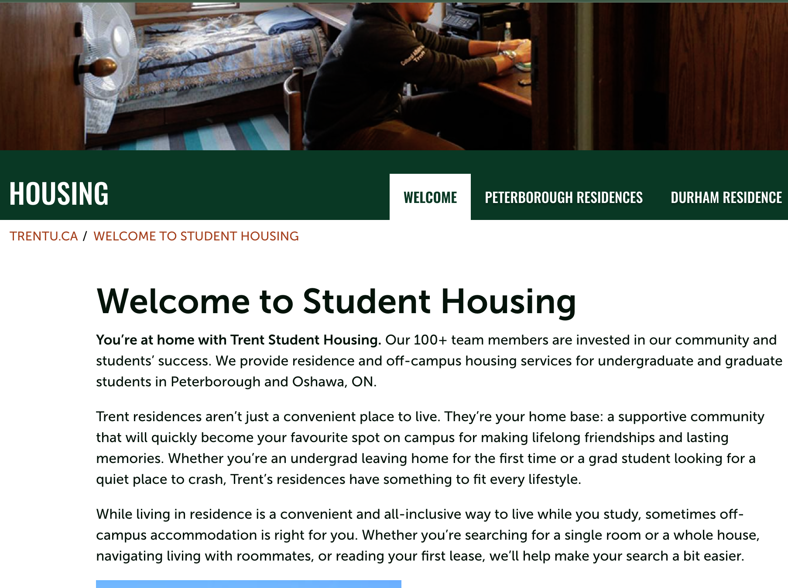

# Workshop 4

## Emphasis

By: Mohammed Bello Ibrahim

Welcome to Student Housing
*You’re at home with Trent Student Housing*. Our 100+ team members are invested in our community and students’ success. We provide residence and off-campus housing services for undergraduate and graduate students in _Peterborough and Oshawa, ON_.

## strong

**Trent residences aren’t just a convenient place to live**. They’re your home base: a supportive community that will quickly become your favourite spot on campus for making lifelong friendships and lasting memories. Whether you’re an undergrad leaving home for the first time or a grad student looking for a quiet place to crash, __Trent’s residences have something to fit every lifestyle.__

## lists

### Unordered list
- list item 1
- list item 2
  - sub item 1
  - sub item 2

### Ordered list

1. First item 
2. Second item
   1. sub item one
   2. sub item two
3. Thrid item


While living in residence is a convenient and all-inclusive way to live while you study, sometimes off-campus accommodation is right for you. Whether you’re searching for a single room or a whole house, navigating living with roommates, or reading your first lease, we’ll help make your search a bit easier.

## Images 




## Hyperlinks

[Student housing departement website](https://www.trentu.ca/housing/)

## Including code 

### Inline 

In Html the `<Image>` tag is used to display pictures.

### Code Fences

```html
<nav>
        <ul>
          <li><a href="index.html">Home</a></li>
          <li><a href="grid.html">Grid</a></li>
          <li><a href="https://trentu.ca">Trent</a></li>
          <li><a href="https://loki.trentu.ca">Loki</a></li>
        </ul>
      </nav>
```

```css
body {
  font-family: system-ui, -apple-system, BlinkMacSystemFont, "Segoe UI", Roboto,
    Oxygen, Ubuntu, Cantarell, "Open Sans", "Helvetica Neue", sans-serif;
  height: 100vh;
  display: flex;
  flex-direction: column;
}
```